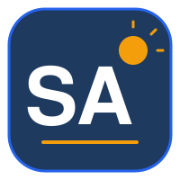
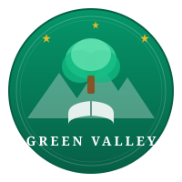
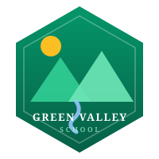
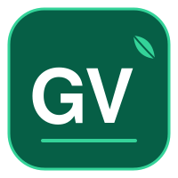
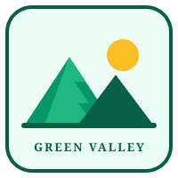

# Logo Catalog — Sample Organizations

Multiple logo options for the two sample organizations. Every variant exists as an **SVG** (crisp at any size, used in the web app and print) and a **PNG** (400×400, used in report card PDFs) under [`assets/logos/`](assets/logos/).

---

## Sunrise Academy

**Palette:** Navy `#1e3a5f` · Royal Blue `#2563eb` · Gold `#f59e0b` · Amber `#fbbf24` · Sunset Red `#ef4444`

| Variant | Preview | Style | Best for |
|---------|---------|-------|----------|
| **V1 — Shield Crest** *(currently active)* |  | Traditional academic crest: navy shield, radiant sun with 12 rays, open book, "SA" initials | Report cards, certificates, formal documents |
| **V2 — Circular Sunrise Badge** |  | Round badge with a rising half-sun over horizon lines, gold ring, name arc | Stamps, seals, profile avatars |
| **V3 — Minimal Monogram** |  | Flat rounded square, bold "SA" wordmark with sun accent | App icons, favicons, small-size uses |
| **V4 — Open Book Emblem** |  | Light flat emblem: sun rising from an open book | Letterheads, website headers, light backgrounds |

Files: `logo-sunrise-academy.svg/.png`, `sunrise-v2-circle.svg/.png`, `sunrise-v3-monogram.svg/.png`, `sunrise-v4-book.svg/.png`

---

## Green Valley School

**Palette:** Emerald `#059669` · Deep Green `#065f46` · Mint `#34d399` · Light Mint `#6ee7b7` · Gold `#fbbf24`

| Variant | Preview | Style | Best for |
|---------|---------|-------|----------|
| **V1 — Tree Circle** *(currently active)* |  | Circular badge: layered tree, valley silhouettes, open book, gold stars | Report cards, certificates, formal documents |
| **V2 — Hexagon Valley** |  | Modern hexagon: twin peaks, sun, and a river through the valley | Modern branding, banners, event material |
| **V3 — Minimal Monogram** |  | Flat rounded square, bold "GV" wordmark with leaf accent | App icons, favicons, small-size uses |
| **V4 — Mountain Emblem** |  | Light flat emblem: overlapping peaks with sun | Letterheads, website headers, light backgrounds |

Files: `logo-green-valley.svg/.png`, `green-valley-v2-hexagon.svg/.png`, `green-valley-v3-monogram.svg/.png`, `green-valley-v4-mountain.svg/.png`

---

## How to switch an organization's logo

**Option A — through the app (any variant, any org):**
1. Log in as the org's admin → **Report Cards** → **Customize**
2. Click **Upload Logo** and pick the variant's **PNG** from `assets/logos/`
3. The logo updates in the report card view, print, and PDF download

**Option B — set the default in code (used by `npm run seed:mock`):**
Edit `src/prisma/generate-logos.ts` and point the org's config at the chosen file, or copy the variant over the active file:

```bash
# Example: make the monogram the active Sunrise Academy logo
cp assets/logos/sunrise-v3-monogram.png uploads/logo-sunrise-academy.png
cp assets/logos/sunrise-v3-monogram.svg uploads/logo-sunrise-academy.svg
```

**Regenerating PNGs after editing an SVG:**
```bash
npx tsx -e "import sharp from 'sharp'; import fs from 'fs';
sharp(fs.readFileSync('assets/logos/<name>.svg')).resize(400,400).png().toFile('assets/logos/<name>.png')"
```

> Note: the in-app PDF generator embeds **PNG/JPG only** — always use the PNG version for report cards; SVGs are for the web UI and print views.
